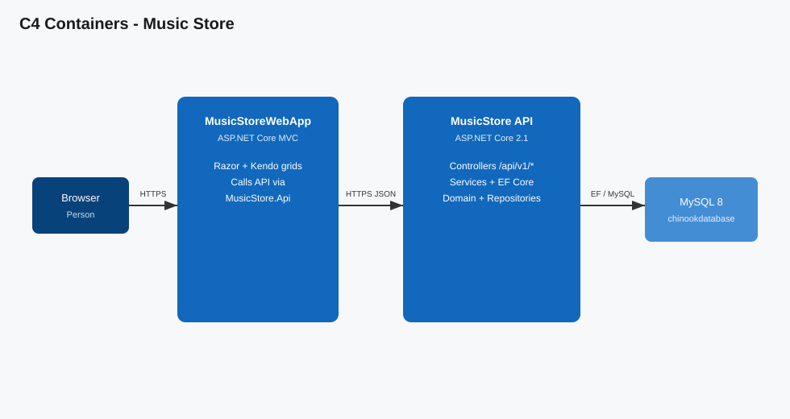
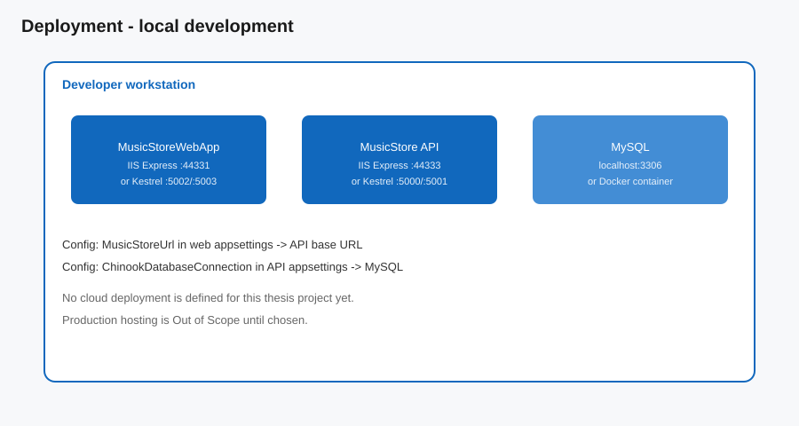

# Architecture Response Document — Music Store

View diagrams with VS Code / Visual Studio Markdown preview (**Ctrl+Shift+V**). Cursor’s inline Markdown toggle may not render SVG.

## Context

### Scope

- Local Chinook music catalog management: artists, albums, tracks, genres, media types, playlists, customers, employees, invoices.
- HTTP JSON API (`MusicStore`) persisted in MySQL `chinookdatabase`.
- MVC web UI (`MusicStoreWebApp`) that consumes the API via `MusicStore.Api` client helpers and Telerik/Kendo grids.

### Out of Scope

- Cloud / production hosting choice and IaC
- Authentication / authorization product features
- Multipayer commerce / payment gateway
- Full DDD re-layering (tracked as incremental refactor under the engineering charter)

## Proposed Approach

Keep the existing two-process local architecture (API + Web UI) on **.NET 10** with Pomelo EF Core MySQL (Pomelo **9.x** until official Pomelo 10 ships). Document real trust boundaries honestly. CI builds the API solution and runs characterization tests on every PR. Grow toward charter layers incrementally (extract Application project, purify Domain of EF attributes) behind a green pipeline — no big-bang rewrite.

## Individual Components Roles and Responsibilities

| Component | Role |
| --------- | ---- |
| `MusicStore` (host) | ASP.NET Core API presentation + DI composition root + application services (`net10.0`) |
| `MusicStore.Domain` | Entity types for Chinook aggregates (`net10.0`; still EF-annotated — debt) |
| `MusicStore.Repository` | Repository port interfaces |
| `MusicStore.Repository.MySql` (`ClassLibrary1`) | EF `UnitOfWork` + MySQL repository adapters (Pomelo 9) |
| `MusicStore.Repository.MsSql` | Alternate SQL Server adapters (not primary path) |
| `MusicStore.Api` | HTTP client + DTO/request types used by the web UI (anti-corruption toward the API) |
| `MusicStoreWebApp` | Razor UI; calls API; Telerik/Kendo presentation (`net10.0`) |
| MySQL `chinookdatabase` | System of record |

### Diagrams

## Deployment

**Current:** developer workstation only.

- API: IIS Express `https://localhost:44333` (VS default) or Kestrel `https://localhost:5001`
- Web UI: IIS Express `https://localhost:44331` or alternate Kestrel ports
- MySQL: `localhost:3306` or Docker container `musicstore-mysql`
- Seed: `docs/chinook new.sql`

No production deployment topology exists yet.

## Dependencies

| Dependency | Purpose |
| ---------- | ------- |
| .NET 10 / ASP.NET Core | Host |
| EF Core 9 + Pomelo.EntityFrameworkCore.MySql 9.0 | Persistence (Pomelo 10 not GA yet; Pomelo 9 runs on net10) |
| Microsoft.AspNetCore.Mvc.NewtonsoftJson | PascalCase JSON |
| Telerik.UI.for.AspNet.Core 2026.3.x | Kendo MVC helpers in WebApp |
| MySQL Server 8 | Database |
| Docker (optional) | Local MySQL |

## Data Flows / APIs

Primary pattern: Web UI → `MusicStoreUrl` + `/api/v1/{resource}` → repositories → MySQL.

Examples:

- `GET /api/v1/employees`
- `GET /api/v1/artists`
- `GET|POST|PUT|DELETE /api/v1/albums`, `tracks`, `customers`, `invoices`, …

See sequence diagram above for the employee list flow. Runnable commands: [README.md](../../README.md).

## Security Concerns

### CIA (current local system)

| Property | Meaning here | How achieved today |
| -------- | ------------ | ------------------ |
| Confidentiality | Catalog/HR-ish sample data on a developer machine | Localhost binding; no internet exposure by default |
| Integrity | Chinook rows should not be corrupted by malformed writes | Model validation on some requests; DB constraints in Chinook schema |
| Availability | Dev can run API + UI against MySQL | Manual process start; no HA |

### AuthN / AuthZ

**None.** All API and UI endpoints are anonymous. Explicit: public within the local network that can reach the ports.

### Secrets

- MySQL connection string in `MusicStore/MusicStore/appsettings.json` (no password in default local string).
- Telerik NuGet API key lives in the developer’s NuGet credential store — **must not** be committed.
- No secrets manager.

### Transport

- Dev HTTPS via IIS Express / Kestrel certificates.
- API uses `UseHttpsRedirection`.
- Certificate trust is a local-dev concern (browser / `HttpClient` may need to trust the ASP.NET HTTPS cert).

### Top risks for this surface

1. **Unauthenticated write API** — anyone who can reach the API can mutate Chinook data.
2. **Connection string / NuGet credentials leakage** if copied into source or screenshots.
3. **Telerik trial expiry** — WebApp build/licensing depends on an active Telerik trial/license.
4. **Client ignores TLS errors** if developers disable validation to call localhost HTTPS — increases MITM risk off-localhost.

### Threat view (list employees)

| Asset | What can go wrong | Mitigation today |
| ----- | ----------------- | ---------------- |
| Employee PII in DB | Unauthenticated read/write via API | Localhost-only usage; no AuthN yet |
| Session to API | WebApp misconfigured `MusicStoreUrl` → wrong host | Documented in README; connection refused fails closed for UI |

### Fitness checks

- GitHub Actions CI: restore + build `MusicStore.sln` + `dotnet test` on every pull request targeting `master`/`main`.
- Web UI restore/build is **not** in CI yet (private Telerik feed); tracked as follow-up once a secret feed is available.

## COGS

Negligible for local thesis use (developer machine + optional free MySQL/Docker). No cloud spend defined.
